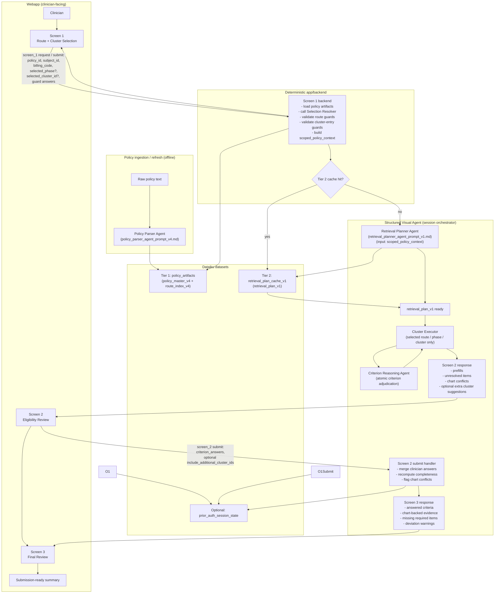

# Prior Auth Assistant — Framework Flowchart

Notes:
- Tier 1 uses the canonical `policy_artifacts` dataset to store `policy_master_v4` and `route_index_v4`.
- Tier 2 uses a deterministic `retrieval_plan_cache_v1` dataset keyed by `policy_id`, `selected_route_id`, `selected_phase`, `selected_cluster_id`, and planner-related version fields.
- The Selection Resolver produces `scoped_policy_context`, which is the minimal input bundle for the retrieval planner.
- Screen 1 is fully deterministic and stays in app/backend code.
- The Structured Visual Agent plays the critical orchestration role from retrieval planning through criterion reasoning and final aggregation.
- The runtime evaluates only the selected route/phase/cluster scope; it does not walk the whole legacy questionnaire tree.
- The optional `prior_auth_session_state` dataset is only needed if the webapp should support resume/reload behavior.
