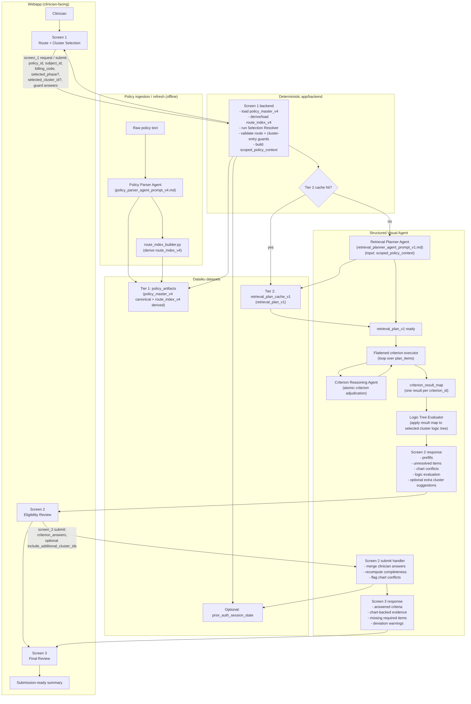

# Prior Auth Assistant — Framework Flowchart

Notes:
- Tier 1 stores canonical `policy_master_v4` plus derived `route_index_v4`.
- Tier 2 stores `retrieval_plan_v1` keyed by selected route, phase, and cluster.
- Screen 1 is deterministic backend logic.
- Screen 1 cluster shortlists should stay disease-specific, including continuation branches.
- The Structured Visual Agent is the critical orchestration layer from retrieval planning through final aggregation.
- POC execution is flattened: evaluate each criterion once, build `criterion_result_map`, then evaluate the selected logic tree.
- Runtime scope is limited to the selected route/phase/cluster; it does not walk the full legacy questionnaire tree.
