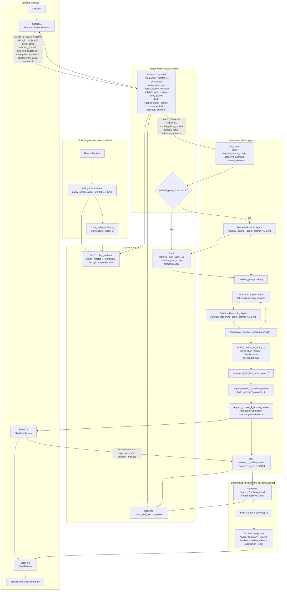

# Prior Auth Assistant — Framework Flowchart

Notes:
- Don't overcode. This is a POC.
- `policy_master_v4` is the canonical policy artifact; `route_index_v4` is a deterministic routing view derived from it.
- Screen 1 is deterministic backend logic and owns route resolution, phase selection, cluster selection, and guard collection.
- Screen 1 may return partial clinician answers for selected route guards and cluster-entry guards as initial `criterion_answers`; skipped questions remain unanswered.
- The Structured Visual Agent begins only after scope selection and stores the inner `scoped_policy_context` object as `selected_scope_context`.
- Screen 2 compares chart-backed `criterion_result_map` against clinician input from either Screen 1 or Screen 2 when setting conflict flags in `criterion_ui_map`.
- `criterion_answers` is the working clinician-input map; `approved_criterion_answers` is the approved or submitted snapshot after review.
- Native DSS approval mode uses the managed Python tool as the actual human-review checkpoint.
- Standard webapp review mode uses the same payload shape but collects approved clinician edits directly from the webapp submit flow.
- After approval or submit, the backend/webapp layer deterministically merges approved edits, rebuilds UI state, recomputes logic, and emits the Screen 3 payload.
- POC execution stays flattened: evaluate each criterion once, build `criterion_result_map`, then apply results back to the selected logic tree.
